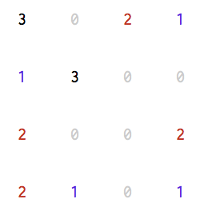

OneFileProject
==============

## threes.py
__[Not Finished]__

Emurator of iOS's game ['threes!'](https://itunes.apple.com/jp/app/threes!/id779157948?mt=8) in console.

## L-system.py
__[Finished]__

class of [L-system](http://en.wikipedia.org/wiki/L-system).

## deleted_tweets_reporter.py
__[Finished]__

This program report deleted tweets on your twitter timeline by email.

